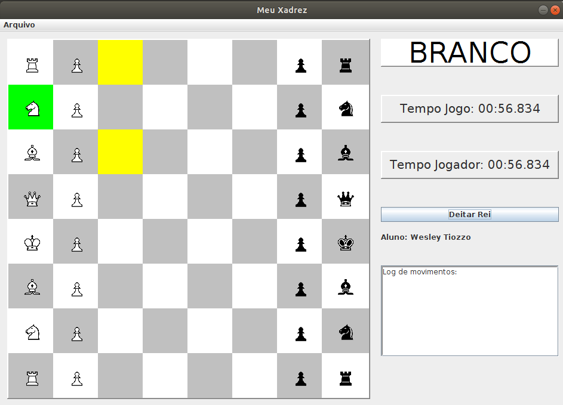
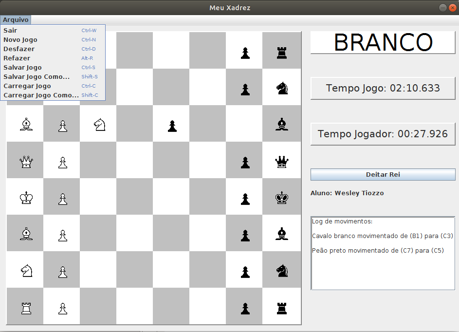

# Chess



OVERVIEW
--------------------------------------------------
This is an implementation of a chess game for the [Object Oriented Programming] course. The purpose of this project was to develop a chess game using the Java language programming and applying Object Oriented concepts along with `Design Patterns` and `Model-View-Controller` (MVC) architectural pattern. It was made at the Computer Science undergraduate program from University of São Paulo (ICMC - USP).

The Design Patterns that were used are: `Singleton`, `Observer`, `Factory` and `Mediator`.

HOW TO COMPILE
--------------------------------------------------

```bash
  1. Clone repository: git clone https://github.com/wesjrock/chess.git
  2. Install Netbeans 
  3. Open Netbeans and select Open Project
  4. Select the folder 'xadrez2d'
  5. Compile and Run
  
  PS. The main() function is inside the DeskChess.java file.
```

HOW TO PLAY
--------------------------------------------------
Just use the mouse.

OPTIONS
--------------------------------------------------

```bash
 * Exit       (Ctrl + W)
 * New Game   (Ctrl + N)
 * Undo       (Ctrl + O)
 * Redo       (Alt + R)
 * Save game  (Ctrl + S)
 * Save as    (Shift + S)
 * Load game  (Ctrl + C)
 * Load as    (Shift + C)
```

MORE INFO
--------------------------------------------------

You can find more information about the project in the files: `assignment report.pdf` and `specification partx.pdf`
